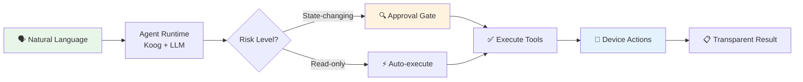

<div align="center">

# 🐾 FoneClaw

### The open AI agent that actually controls your Android phone

**One voice command. 120+ real actions. No root required.**

[](https://foneclaw.ai)
[](docs/architecture.md#internationalization)
[](LICENSE)
[](https://foneclaw.ai)

[🌐 Website](https://foneclaw.ai) ·
[📖 Docs](docs/overview.md) ·
[⭐ Star this repo](https://github.com/FoneClaw-AI/foneclaw-android/stargazers) ·
[💬 Request a feature](https://github.com/FoneClaw-AI/foneclaw-android/issues/new?assignees=&labels=feature-request&template=feature-request.md)

</div>

---

> **FoneClaw doesn't just answer questions — it does things.** Tell it *"check my work email and summarize the urgent ones"*, and it opens your mail app, reads the inbox, filters by sender, reads each thread, and reports back. All through natural language, all on-device via the Accessibility Service.

---

## ✨ Why FoneClaw?

Most "AI assistants" live in a chat bubble and can't touch your phone. FoneClaw is different — it acts as a **real agent layer on top of Android**, able to see your screen, tap buttons, fill forms, and chain actions across apps.

| | Traditional Assistants | **FoneClaw** |
|---|---|---|
| **What it can do** | Fixed voice commands | 120+ tools across 16 categories |
| **How far it goes** | One app at a time | Cross-app multi-step workflows |
| **Screen awareness** | None | Full UI tree reading + tap / swipe / gesture |
| **Safety model** | Implicit trust | Risk-graded approval before any risky action |
| **Extensibility** | Closed | Open community Skills & Workflows |

## 📊 By the Numbers

| | |
|---|---|
| **120+** | Built-in tools (mail, maps, phone, SMS, calendar, device settings, …) |
| **16** | Action categories |
| **14** | Supported languages |
| **7** | Community Skills ready to use |
| **0** | Root access required |

## 🚀 Quick Start

1. **Download** — Grab the latest APK from the [Releases page](releases/README.md) or visit [foneclaw.ai](https://foneclaw.ai).
2. **Install & Launch** — Follow the setup wizard.
3. **Enable Accessibility** — Grant the Accessibility Service permission (required for on-screen automation).
4. **Talk to it** — Try: *"Find Italian restaurants near me and send the top pick to Sarah"*.

**Requirements:** Android 9 (API 28) or above.

## 🏗️ How It Works



Every action flows through a **risk-graded approval system** — read-only operations run instantly, while anything that sends data, changes settings, or deletes content pauses for your confirmation.

📖 **Deep dive:** [System Architecture](docs/architecture.md) · [Security & Privacy Model](docs/security.md)

## 🧩 Extend FoneClaw

### Community Skills

Skills are knowledge packs that teach FoneClaw specialized workflows. Browse and contribute:

| Skill | What it does |
|-------|-------------|
| 📧 [`mail`](skills/mail/) | Smart email triage & sending |
| 🗺️ [`navigation`](skills/navigation/) | Turn-by-turn route planning |
| 📶 [`wifi`](skills/wifi/) | Wi-Fi network management |
| 🔵 [`bluetooth`](skills/bluetooth/) | Bluetooth pairing & control |
| 🛒 [`shopping`](skills/shopping/) | Price comparison across stores |
| 🔍 [`webResearch`](skills/webResearch/) | Multi-source web research |
| 📲 [`openApp`](skills/openApp/) | App launch & deep-link routing |

➡️ **Write your own:** [Skill Format Guide](docs/skills/skill-format.md) · [Tool Catalog](docs/tool-policy/tool-catalog.md) · [Skill Template](skills/_template/SKILL.md)

### Workflow Templates

No-code automation recipes — record once, replay forever without LLM calls:

- [`check-work-email`](workflows/examples/check-work-email.json) — Morning email triage
- [`home-wifi-connect`](workflows/examples/home-wifi-connect.json) — Auto-connect on arrival

➡️ **Create your own:** [Workflow Format Guide](docs/workflows/workflow-format.md) · [Tool Catalog](docs/tool-policy/tool-catalog.md)

## 🔒 Security & Privacy

FoneClaw's core risk is **"model decides + device executes"** — so safety is built into the architecture, not bolted on:

- **Risk-graded tools** — every tool declares its risk level; high-risk tools never run without your tap.
- **Approval UI** — see the tool name, sanitized parameters, and impact before confirming.
- **Sensitive data protection** — passwords & API keys never pass through the LLM; email credentials are AES-256-GCM encrypted.
- **Transparent execution** — every tool call is logged and visible.

📖 **Full breakdown:** [Security & Privacy Model](docs/security.md)

## 📁 Repository Structure

```
foneclaw-android/
├── docs/                 Product & technical documentation
│   ├── overview.md       What FoneClaw is
│   ├── architecture.md   How it works under the hood
│   ├── security.md       Risk levels, approvals, privacy
│   └── scenarios.md      Real-world use cases
├── skills/               Community Skills (extend FoneClaw's knowledge)
│   ├── mail/ bluetooth/ wifi/ ...
│   └── _template/        Starter template for new skills
├── workflows/            No-code automation templates
│   ├── examples/         Ready-to-use workflows
│   └── _template/        Starter template
├── releases/             Release notes & version metadata
└── .github/              Issue & PR templates for contributors
```

## 🤝 Contributing

We welcome community contributions! The fastest ways to help:

- ⭐ **Star this repo** — helps others discover FoneClaw.
- 🧩 **Share a Skill** — [submit a skill](https://github.com/FoneClaw-AI/foneclaw-android/issues/new?assignees=&labels=skill-submission&template=skill-submission.md) for a domain you know well.
- 🐛 **Report issues** — [open a bug report](https://github.com/FoneClaw-AI/foneclaw-android/issues/new?assignees=&labels=bug&template=bug-report.md).
- 💡 **Suggest features** — [request a feature](https://github.com/FoneClaw-AI/foneclaw-android/issues/new?assignees=&labels=feature-request&template=feature-request.md).

📖 Read [CONTRIBUTING.md](CONTRIBUTING.md) to get started.

## 📚 Documentation

- [Product Overview](docs/overview.md) — What FoneClaw is and how it works
- [System Architecture](docs/architecture.md) — High-level technical design
- [Security & Privacy](docs/security.md) — Tool risk levels, approvals, and data boundaries
- [Core Scenarios](docs/scenarios.md) — What users can accomplish
- [Tool Policy](docs/tool-policy/overview.md) — How risk levels and approvals work
- [Tool Catalog](docs/tool-policy/tool-catalog.md) — Built-in tool names for Skills and Workflows
- [Skill Format](docs/skills/skill-format.md) — How to write a skill
- [Workflow Format](docs/workflows/workflow-format.md) — How to create workflow templates

## 📄 License

FoneClaw's public documentation, Skills, and Workflow templates are released under the **[MIT License](LICENSE)**.

<div align="center">

**[🌐 foneclaw.ai](https://www.foneclaw.ai)** · Made with ❤️ for people who want their phone to actually listen.

</div>
