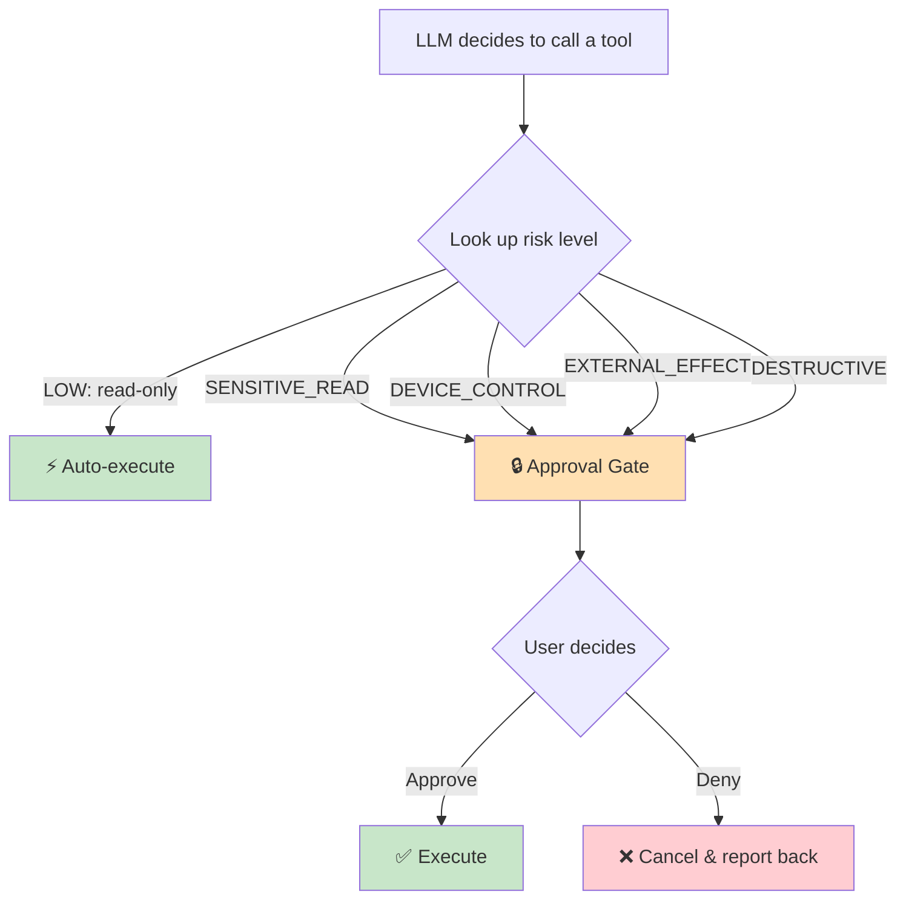
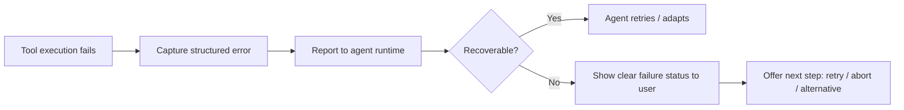

# Security & Privacy Model

> FoneClaw's core risk is **"model decides + device executes."** An AI agent that can read your screen, tap buttons, send emails, and delete data needs a safety model you can actually trust. This document explains how FoneClaw is built so that **you stay in control**.

---

## TL;DR

| Principle | How FoneClaw enforces it |
|-----------|--------------------------|
| **Nothing risky runs without your tap** | Every state-changing tool pauses for explicit approval |
| **Sensitive data never reaches the LLM** | Passwords, API keys, and credentials stay on-device, encrypted |
| **You see everything the agent does** | Every tool call is visible with its parameters and result |
| **Failures are explainable & recoverable** | No silent failures — you always get a clear status |
| **Safety is verified at compile time** | Risk levels are enforced by code, not by prompts |

---

## The Risk-Graded Approval System

FoneClaw doesn't treat all actions equally. Every tool is classified into one of **five risk levels**, and the system enforces a hard rule: **only read-only tools can run automatically — everything else waits for your confirmation.**

### The Five Risk Levels

| Level | What it means | Approval | Examples |
|-------|---------------|----------|----------|
| 🟢 **LOW** | Read-only, no side effects, no private data | Auto | `web_search`, `wifi_status`, battery check |
| 🟡 **SENSITIVE_READ** | Reads your private data | Approval required | `mail_list`, `sms_recent`, `get_location`, `screenshot_take` |
| 🟠 **DEVICE_CONTROL** | Changes device state | Approval required | `wifi_connect`, `volume_set_stream`, `flashlight_toggle` |
| 🔴 **EXTERNAL_EFFECT** | Affects the outside world | Approval required | `mail_send`, `phone_dial`, `sms_send`, `calendar_create_event` |
| ⛔ **DESTRUCTIVE** | Permanently destroys data | Approval required | `mail_delete`, `wifi_forget`, `workflow_delete` |

📖 **Full tool-by-tool classification:** [Tool Policy Reference](tool-policy/overview.md)

### What You See in the Approval Card

When a tool needs your confirmation, FoneClaw shows a clear card **before** anything happens:

- **Tool name** — what capability is being used
- **Sanitized parameters** — sensitive values (like full email addresses or message bodies) are masked
- **Risk level indicator** — color-coded so you can judge at a glance
- **Plain-language description** — what the tool will actually do

You can **approve** or **deny** at any time. If you deny, the agent receives the rejection and can suggest an alternative or explain why the action was needed.

---

## How Safety Is Enforced

### Compile-Time Guarantee

The risk levels aren't just documentation — they're **enforced in code** at compile time via a Kotlin Symbol Processing (KSP) annotation system:

1. Every tool method is annotated with its policy, e.g. `@BuiltInTool(policy = BuiltInToolPolicy.MAIL_SEND)`
2. The annotation processor validates the rules:
   - No duplicate tool names
   - **No tool above LOW risk can be set to auto-approve** — this is a build error, not a warning
   - Every policy is bound to exactly one function
3. A generated registry (`GeneratedBuiltInToolIndex`) is the single source of truth at runtime

This means **a developer cannot accidentally ship a tool that silently auto-deletes your email**. The build will fail.

### Runtime Behavior

At runtime, the agent's decision to call a tool triggers a policy lookup:

- **AUTO** tools execute immediately (read-only, safe)
- **REQUIRE_APPROVAL** tools suspend execution and wait for your decision
- The agent cannot bypass this gate — the runtime enforces it regardless of what the LLM "wants" to do

---

## Privacy & Data Protection

FoneClaw has deep access to your phone. Here's exactly how sensitive data is handled.

### What Never Leaves Your Device

| Data type | Handling |
|-----------|----------|
| **Email credentials** | Stored encrypted (AES-256-GCM), never passed to the LLM, never logged |
| **API keys** | Not persisted in plaintext; injected at runtime |
| **Passwords** | Never stored by FoneClaw; managed by the system |
| **Account tokens** | Encrypted at rest via `ConfigEncryptor` |

### What the LLM Can See

The LLM (which may be cloud-hosted) receives:

- Your **conversation text** (your prompts and the agent's reasoning)
- **Tool call requests** (tool name + parameters)
- **Tool results** needed to continue the task

To minimize exposure, **sensitive parameters are sanitized before reaching the LLM**. For example, when summarizing emails, the LLM sees the summary — not necessarily every raw credential or token used to fetch them.

### Sensitive Data in Logs & Trace

| Category | Examples | Log handling |
|----------|----------|--------------|
| 🚫 Never logged | Passwords, API keys, full credentials | Fully excluded |
| ⚠️ Minimized | Email addresses, phone numbers, message bodies | Masked / truncated in logs |
| ✅ Logged | Tool names, risk levels, execution status | Recorded for transparency |

---

## Failure & Recovery

AI agents will sometimes fail — a button isn't where expected, a network drops, a permission is missing. FoneClaw is designed so failures are **explainable and recoverable**, never silent.

### What Happens on Failure

Every tool returns a **structured result** — success or failure — with a human-readable explanation. The agent can then:

- **Retry** with adjusted parameters
- **Fall back** to an alternative approach
- **Report back** to you with what went wrong and what it tried

### Long-Running Operations

Operations that could hang (network calls, system waits) are guarded with **timeouts** (`withTimeoutOrNull`) so a stuck action never freezes the agent permanently.

---

## Permission Boundaries

FoneClaw respects Android's permission system. It does not request blanket permissions or work around restrictions.

| Capability | Permission required | How it's used |
|------------|---------------------|---------------|
| **Screen control** | Accessibility Service | Read UI tree, tap, swipe, gesture — the core automation layer |
| **Location** | Fine/Coarse Location | Used only when a location tool is invoked |
| **Contacts/Call log/SMS** | Respective runtime permissions | Read only when the corresponding tool runs |
| **Mail** | App-internal encrypted config | Credentials managed by FoneClaw, not shared |
| **Network** | Internet | For LLM API calls and web tools |

All permission checks happen **before** the tool runs. If a permission is missing, FoneClaw reports it clearly rather than failing opaquely.

---

## Design Philosophy

1. **Fail safe** — When in doubt, require approval. The system defaults to the more restrictive mode.
2. **Transparency over stealth** — You always see what the agent is doing and why.
3. **Human override always wins** — You can deny any action, anytime. The agent adapts.
4. **Code-enforced, not prompt-enforced** — Safety rules live in the build system, not in LLM instructions that could be circumvented.
5. **Minimal data exposure** — The LLM gets only what it needs, sanitized, never more.

---

## Related Documentation

- [Tool Policy Reference](tool-policy/overview.md) — Complete per-tool risk classification
- [System Architecture](architecture.md) — How the runtime, approval gate, and tools fit together
- [Product Overview](overview.md) — What FoneClaw does and how to get started
