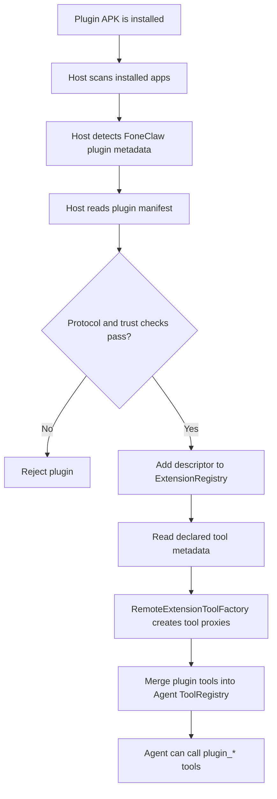
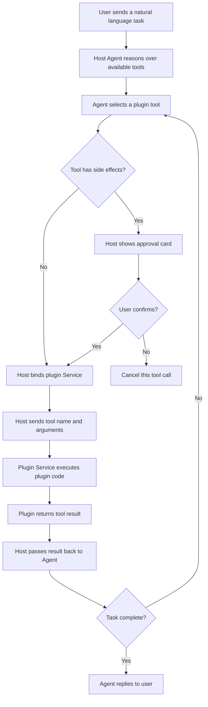
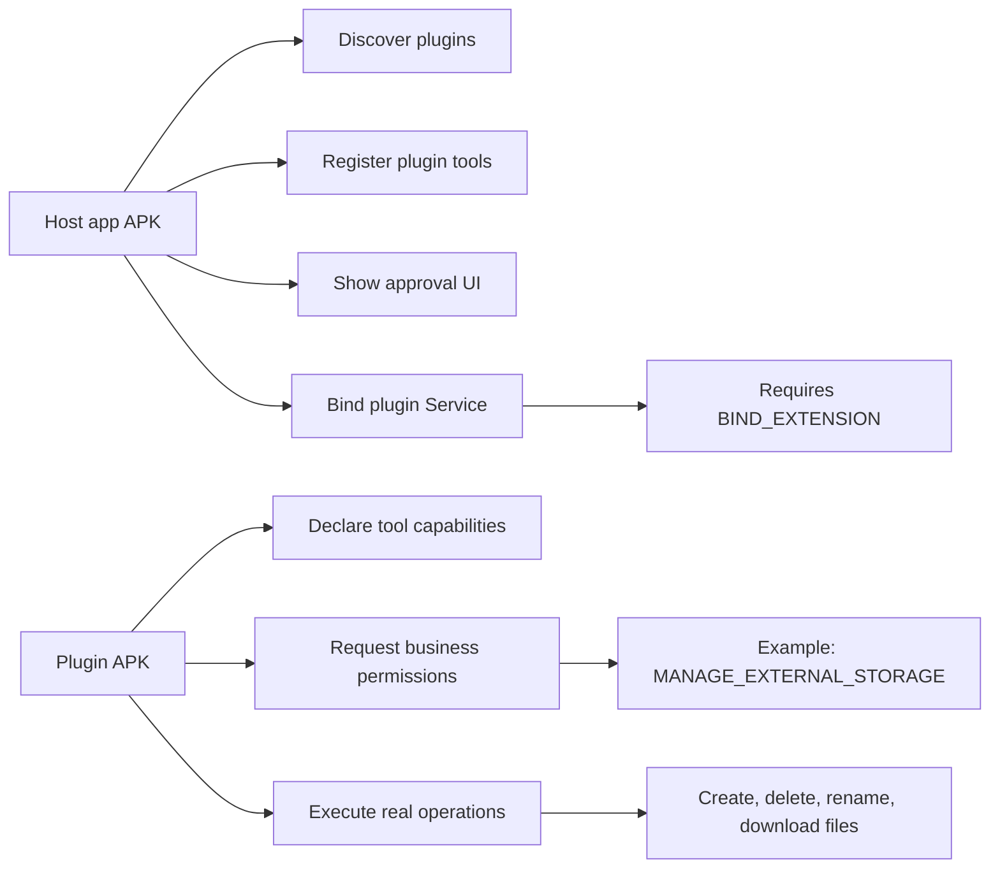

# FoneClaw Plugin Workspace

This directory keeps Android plugin samples, source packages, and generated
plugin distribution metadata for the public FoneClaw Android release repo.

- `demo/`: standalone demo plugin APK project.
- `source/`: reserved for plugin source packages or templates.
- `plugins/`: reserved for published plugin index metadata and APK artifacts.

## Compatibility

The plugin system requires FoneClaw Android app `0.0.6` or later. Earlier app
versions do not include the host-side plugin discovery, tool registration, and
protected service binding flow needed to run plugin APK tools.

## Runtime Model

FoneClaw plugins are distributed as independent Android APKs. The host app
discovers installed plugin APKs, reads their plugin manifests, registers their
declared tools into the Agent tool registry, and calls the plugin service after
the user approves a side-effecting action.

The host app owns orchestration and approval. The plugin APK owns its declared
business permissions and executes the actual operation inside plugin code.

## Plugin Loading Flow



For example, the file manager plugin exposes tools such as:

```text
plugin_file_manager_list
plugin_file_manager_create_file
plugin_file_manager_create_folder
plugin_file_manager_batch_rename_preview
plugin_file_manager_batch_rename_apply
plugin_file_manager_delete
plugin_file_manager_download
```

## Tool Execution Flow



File operations usually require multiple approvals because each write,
delete, rename, or download is a separate side-effecting tool call. A batch
rename flow commonly looks like this:

```text
create_folder -> approval
create_file -> approval
create_file -> approval
batch_rename_preview -> approval
batch_rename_apply -> approval
list -> approval or auto execution, depending on policy
```

## Permission Boundary



The host app defines and requests `ai.android.claw.permission.BIND_EXTENSION`.
This signature permission protects plugin services so only the signed FoneClaw
host can bind and invoke them.

Each plugin APK requests the permissions needed for its own business logic. For
example, the file manager plugin requests `MANAGE_EXTERNAL_STORAGE`, legacy
external storage permissions for older Android versions, and `INTERNET` for
downloads. The host app does not need `MANAGE_EXTERNAL_STORAGE` for file manager
plugin operations, because the file operation runs inside the plugin APK.

On Android, `MANAGE_EXTERNAL_STORAGE` is a special AppOps permission. It may
appear as `granted=false` in package install permissions even when the user has
enabled all files access. The effective state should be checked through the
system all files access page or:

```powershell
adb shell appops get ai.android.claw.plugin.device.filemanager MANAGE_EXTERNAL_STORAGE
```

Expected enabled state:

```text
MANAGE_EXTERNAL_STORAGE: allow
```

## Host And Plugin Responsibilities

```text
Host app:
- discover installed plugin APKs
- validate plugin metadata and trust
- register plugin tools into the Agent
- reason over user tasks
- show approval UI for side-effecting tools
- bind plugin services and forward tool calls
- return plugin results to the Agent

Plugin APK:
- declare plugin metadata and tool schemas
- request business permissions
- expose a protected plugin service
- execute real business operations
- validate paths, arguments, and safety constraints
- return structured tool results
```
